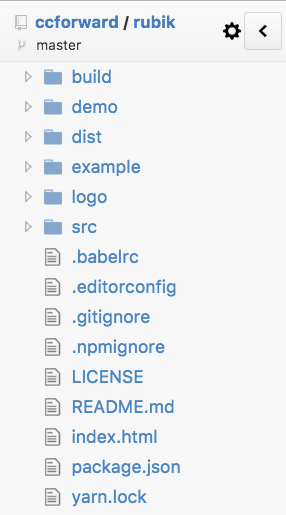

# Vue.js 组件库 Rubik UI 开发心得总结

Rubik UI 是一套基于 Vue 2.0 和 Material Design 开发的桌面端、移动端组件库

## 开发目的

因为公司内部系统开发的越来越多，而却同事们的要求也越来越高，不仅要好用而且要好看，看惯了 Bootstrap 自然会产生视觉疲劳，因此设计师同学的需求越来越多、后台系统各种体验不统一，因此就自发决定：

* 开发一套组件库，首先提升后台的可用性和用户体验
* 设计师 "轻" 参与，选定 Material Design 作为视觉的规范
* 尽可能保证组件库也能用于前台和移动端

## 设计、思考阶段

因为亲自从零参与并开发了几个后台，发现之前开发的各个业务组件的共性太低，不同后台业务需求差距也比较大，即使开发了通用的业务级组件，后续也跟不上需求的变化速度，因此只专注基础组件，同时也有利于保证组件库的 "轻量级" 特性和后续用于前台移动端的项目。

## 开发过程

### 确认视觉规范

这一步设计师来主导，制定基础的颜色、字体等规范。

因为决定参照 Material Design 的设计来开发，因此这一步进展的很快很顺利

其中这时候也确认了 LOGO 的设计：一个扁平化的魔方

### 确认基础组件

这是每一个组件库都会做的，我主要参考了 Bootstap 和 materializecss 的组件库，并结合业务中抽象出来的基础组件，最终确认了初期的组件开发任务。

### 确认技术栈

只支持 Vue.js 2.0+

webpack + ES2015 + stylus 做 js 和 css 构建

Karma + mocha 做单元测试

### 组件示例

直接在项目目录下新建一个 `example` 目录，并结合 `Vue-Router` 开发成一个单页应用，每个单独 `view` 作为一个组件的 demo，目录如下：

 

这样就可以在 push master 分支的同时并在 GitHub Pages 上作为官网展示了

