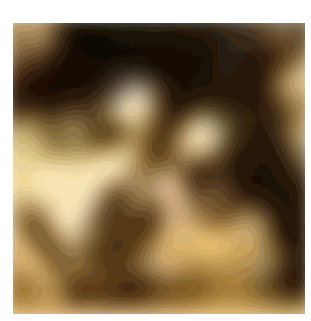

# 渐进式图片加载

[知乎](https://www.zhihu.com/)和 [Medium](https://medium.com/) 都用了 progressive image （渐进式图片加载），用低分辨率的模糊图片来做预览图，代替以前懒加载图片时用的 logo 占位图。预览图大小也在平均 2KB~3KB 之间，虽然 cdn 流量上有所增加，但用户体验却非常好。



知乎和 Medium 使用的是动态绘制 canvas 这种比较复杂的方式来展现模糊效果，所以来实现一个只需要 HTML、CSS、JS 就能实现的渐进式图片懒加载。

先看 [demo]()

## HTML
基本的 HTML 结构如下

```html
<div class="progressive">
  
</div>
```

origin.jpg 就是原图，preview.jpg 是等比压缩后的预览图，比如原图是 400*200 则预览图可以使 20*10。

如果原图是 400*100 按照 4:1 的比例，预览图如果宽度是30，那么高度就是 7.5，所以图片裁剪这里会有坑，后面会遇到。

## CSS

### 容器的基本样式

```css
.progressive {
  position: relative;
  display: block;
  overflow: hidden;
}
```

外层的 .progressive 默认是 `div` 也可以是其他任何需要的包裹元素

图片容器可以是固定尺寸，也可以是固定的宽高比(用 `padding-top` 的方式来确保容器的固定的宽高比例)，这就保证了原始图片加载之后不会出现容器尺寸的变化，然而这就必须计算每张图片的宽高比例。

知乎和 Meduim 都是获取到了原图尺寸，然后保持预览图(canvas)也是相同的尺寸，这样即使预览图被裁剪后和原图尺寸的比例不一致，也不会出现容器尺寸在原图加载之后会抖动的bug。

我们退而求其次，采取更简单粗暴的方式来做：

1. 预览图和原始图尽量保持相同的宽高比
2. 原图加载完后，不删除预览图，而是设置为 `opacity:0`

PS: 如果预览图和原图的比例不一致，同时原图加载后删除预览图，就会出现抖动，如下图


原图尺寸 800*533 裁剪后如果按照比例应该是 20*13.325  但实际是 20*13 ，所以加载原图后空间不够，往下伸展出一部分。因此为了防止抖动的简单处理就加上第二点：不删除原图并设置为透明。


### 容器内图片

预览图和原图都充满容器

```css
.progressive img {
  display: block;
  width: 100%;
  max-width: 100%;
  height: auto;
  border: 0 none;
}
```

预览图模糊处理 

* `blur(2vw)` 是为了保持相同的模糊度，而页面的尺寸无关。
* `transform: scale(1.05);` 添加图片过渡动画

```css
.progressive img.preview {
    filter: blur(2vw);
    transform: scale(1.05);
  }
```

原图局对定位于容器左上角，是为了在动画阶段能覆盖原图。

```css
.progressive img.origin {
  position: absolute;
  left: 0;
  top: 0;
  animation: origin 1s ease-out;
}

@keyframes origin {
  0% {
    transform: scale(1.1);
    opacity: 0;
  }
  100% {
    transform: scale(1);
    opacity: 1;
  }
}
```

## JavaScript

js的处理就简单多了，和懒加载图片没什么区别，主要一个 `checkImage` 函数在 DOMReady 和 scroll 时检测可视区 view 内是否有图片需要懒加载

以及 `loadImage` 函数用来替换预览图，加载原图触发动画。

```js
function checkImage() {
  const lazys = document.querySelectorAll('img.lazy')
  const l = lazys.length
  if(l>0){
    for (var i = 0; i < l; i++) {
      var rect = lazys[i].getBoundingClientRect()
      if (rect.top < window.innerHeight && rect.bottom > 0 && rect.left < window.innerWidth && rect.right > 0) {
        loadImage(lazys[i])
      }
    }
  }else {
    events(window, false)
  }
}
```

## 响应式图片

demo 里最后一张图片用了响应式图片

`data-srcset="./progressive/4.jpg 960w, ./progressive/4-m.jpg 1280w, ./progressive/4-l.jpg 1920w"`

```html
<div class="progressive full">
    
  </div>
```

浏览器如果支持 img 标签的 `srcset` 将会根据 viewport 的宽度选取适当的图片来加载。

## 封装代码


